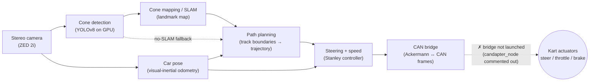
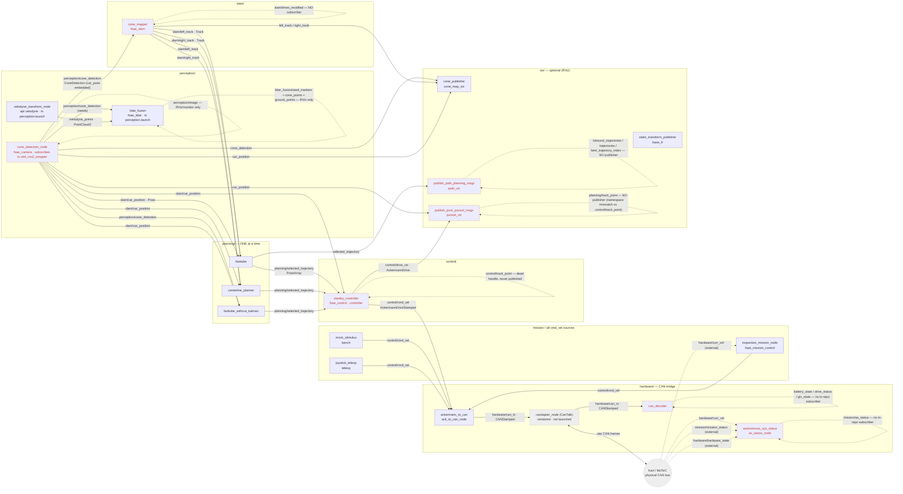

# Architecture & data flow
 
Onboarding diagrams for the `fsae_autonomous` stack. Three views, increasing in detail:
 
1. **High-level pipeline** — the 5-minute "what does it do" view (general terms).
2. **Node ↔ topic graph** — the real ROS 2 wiring (who publishes/subscribes what).
3. **Launch / bring-up tree** — what each `ros2 launch` actually starts.
 
All diagrams are **Mermaid** (render automatically on GitHub). They are hand-built and
**verified against the source** (every `create_publisher` / `create_subscription` and the
C++ camera node) as of this commit. The **connection table** under diagram 2 is the
authoritative, exhaustive list — rebuild from that if you port these to Lucid.
 
> Verify the live graph on the Jetson with `rqt_graph` / `ros2 node info <node>`; that's
> ground truth. These diagrams are the curated, readable version.
 
---
 
## 1. High-level pipeline (conceptual)
 
No node or topic names — just the idea of how data flows from camera to kart.
 

 
**Reading it:** the camera does two jobs — detect cones and estimate where the car is.
Cones build a map; planning turns the map + pose into a target path; control turns the
path + pose into a steering/speed command; the CAN bridge turns that into bus frames the
kart understands. The dashed "no-SLAM fallback" is the `fasttube_without_kalman` planner,
which skips mapping and plans straight off raw detections. **The final hop to the kart does
not work today** — `control → CAN` is real (`cmd_vel → ack_to_can → can_tx`), but `can_tx`
has no subscriber while the CAN-to-bus bridge (`candapter_node`, ported from CanTalk) stays
commented out in `can.launch.py`, so commands stop at the topic and never reach the
actuators until it's enabled on the Jetson (marked ✗ on the diagram).
 
---
 
## 2. Node ↔ topic graph (the real wiring)
 
Boxes are **ROS nodes** (ROS node name on top, package/source beneath). Arrows are
**topics** (labelled with the signal name + message type). Solid = a live publisher→subscriber
link. **Dashed red** = a dangling/orphan/external link (see notes). Only **one planner** and
**one cmd_vel source** run at a time.
 

 
> Mermaid renders the self-loops above as the cleanest way to flag a one-ended (orphan)
> topic. They are **not** real loopbacks — read each as "this node publishes/subscribes a
> topic with no counterpart." Full detail in the table.
 
### Authoritative connection table (every topic, verified from source)
 
| Topic | Type | Carries / does | Publisher(s) | Subscriber(s) | Status |
|---|---|---|---|---|---|
| `/fsae/perception/cone_detection` | `fsae_interfaces/ConeDetection` | `header` (camera capture stamp, `frame_id="camera_link"`) + `car_pose` (ZED pose) + `blue[]`/`yellow[]`/`small_orange[]`/`big_orange[]` cone positions (`Point[]`, in the car's **local** frame). | `cone_detection_node` (camera) | `cone_mapper`, `fasttube_without_kalman`, `cone_map_viz`, `lidar_fusion` | OK. **Car pose is embedded as `car_pose` inside this msg** — that's how SLAM gets pose (it does NOT subscribe `car_position`). **`header.stamp` is what `lidar_fusion` time-matches against its buffered `/velodyne_points` clouds** (`max_time_diff`, default 0.10s). **Gated:** only published when both blue *and* yellow cones are in view (`cone_detection.cpp:442`), so one-sided sections starve all three consumers that frame. **QoS:** camera offers RELIABLE, `cone_mapper` requests BEST_EFFORT (compatible, flows — but the only node that does). |
| `/fsae/perception/image` | `sensor_msgs/Image` | Annotated camera frame (detection boxes drawn) for live monitoring. | `cone_detection_node` | — | Orphan in-repo; RViz/monitoring only. |
| `/velodyne_points` | `sensor_msgs/PointCloud2` | Raw VLP-16 cloud (`x,y,z,intensity,ring`), frame `velodyne`. | `velodyne_transform_node` (apt `velodyne`, launched by `perception.launch.py`) | `lidar_fusion` | Driver + fusion now come up inside `perception.launch.py` (so also in `autonomous.launch.py` transitively). Default-QoS reliable both ends (compatible). |
| `/lidar_fusion/seed_markers` | `visualization_msgs/MarkerArray` | Camera cone seeds projected into the `velodyne` frame + the crop-sphere boundary + the fitted ground-plane disc + the refined-centroid cylinder per seed, for RViz. | `lidar_fusion` | RViz | Debug viz only. |
| `/lidar_fusion/cone_points` | `sensor_msgs/PointCloud2` | In-sphere points that survived ground removal (ABOVE_GROUND — the input to clustering), for RViz. | `lidar_fusion` | RViz | Debug viz only. Component A refinement complete (crop, ground removal, cluster verification, axis-projection centroid); Component B fused publishing still to come. |
| `/lidar_fusion/ground_points` | `sensor_msgs/PointCloud2` | In-sphere points discarded as ground (AT_GROUND) by the per-point z-test, for RViz. | `lidar_fusion` | RViz | Debug viz only. |
| `/cone_detection_fused` | `fsae_interfaces/ConeDetection` | Fused cones: LiDAR-refined positions (camera body frame) + camera colours + `car_pose` copied from the source detection. One msg per time-matched LiDAR cloud (~10 Hz). | `lidar_fusion` | — (intended: `cone_mapper` via remap) | Drop-in replacement for the raw camera topic; unconfirmed detections are absent by policy. |
| `/fsae/slam/car_position` | `geometry_msgs/Pose` | Car pose from **raw ZED visual odometry** — x,y in `position`, **yaw (rad) repurposed into `orientation.w`** (not a real quaternion). | `cone_detection_node` (camera!) | `fasttube`, `centerline_planner`, `fasttube_without_kalman`, `stanley_controller`, `cone_map_viz`, `pursuit_viz` | OK. Note the **camera** publishes this, despite the `slam/` namespace. |
| `/fsae/slam/car_velocity` | `geometry_msgs/Vector3` | Velocity estimate from integrating IMU linear accel (x,y). | `cone_detection_node` | — | **Orphan.** A live publisher (the `car_velocity` thread runs at 100 Hz) but the data is useless — it integrates raw IMU accel and `velocity.cpp` itself says `THIS DOES NOT OUTPUT ACCURATE VELOCITY DATA`; nothing subscribes. |
| `/fsae/slam/left_track` | `fsae_interfaces/Track` | Refined **blue (left)** boundary cone positions, global frame (`Point[] cones`); the KF-smoothed map of the left edge. (`invert_cones:false` default.) | `cone_mapper` | `fasttube`, `centerline_planner`, `cone_map_viz` | OK. A second, built-but-**unlaunched** C++ `cone_landmark_mapper` (`fsae_slam/src`) declares this same topic + `right_track` — dead/orphan code, see `MIGRATION_BUGS.md`. |
| `/fsae/slam/right_track` | `fsae_interfaces/Track` | Refined **yellow (right)** boundary cone positions, global frame (`Point[] cones`). | `cone_mapper` | `fasttube`, `centerline_planner`, `cone_map_viz` | OK. |
| `/fsae/slam/times_modified` | `std_msgs/Float32MultiArray` | Per-landmark confidence/observation counters used by the map prune logic. | `cone_mapper` | — | **Orphan** in-repo. |
| `/fsae/planning/selected_trajectory` | `geometry_msgs/PoseArray` | The single path to follow — centerline waypoints (`Pose[]`; positions only, orientation left zeroed). | `fasttube` **or** `centerline_planner` **or** `fasttube_without_kalman` | `stanley_controller`, `path_viz` | OK. Exactly one publisher live at a time. |
| `/fsae/planning/inbound_trajectories` | `fsae_interfaces/AllTrajectories` | (Old multi-candidate interface) list of in-track candidate paths; its last entry was used as the centerline reference. | — | `path_viz` | **Orphan sub** — no publisher in repo. |
| `/fsae/planning/trajectories` | `fsae_interfaces/AllTrajectories` | (Old multi-candidate interface) all candidate paths from the scrapped scoring planner. | — | `path_viz` | **Orphan sub** — no publisher. |
| `/fsae/planning/best_trajectory_index` | `std_msgs/Int16` | (Old multi-candidate interface) index of the chosen path within `trajectories`. | — | `path_viz` | **Orphan sub** — no publisher. |
| `/fsae/planning/track_point` | `geometry_msgs/Pose` | Intended pure-pursuit look-ahead/target point (the pursuit-viz "next destination" sphere). | — | `pursuit_viz` | **Orphan sub.** Stanley publishes `control/track_point` (different namespace) and even that handle is dead. |
| `/fsae/control/cmd_vel` | `ackermann_msgs/AckermannDriveStamped` | The drive command — `speed` + `steering_angle` (+ accel/jerk fields); the autonomous command source. | `stanley_controller`, `inspection_mission_node`, `mock_stimulus`, `joystick_teleop` | `ack_to_can_node` | OK. **No mux** — only one publisher should run per mission (enforced by launch choice). |
| `/fsae/control/drive` | `ackermann_msgs/AckermannDrive` | Unstamped copy of the drive command, intended for hardware/monitor. | `stanley_controller` | — | Orphan in-repo (intended for hardware/monitor). |
| `/fsae/control/drive_vis` | `ackermann_msgs/AckermannDrive` | Copy of the drive command for the pursuit viz (renders the steering). | `stanley_controller` | `pursuit_viz` | OK. |
| `/fsae/control/track_point` | `geometry_msgs/Pose` | Intended pursuit target point (same idea as the planning one) — never actually built or published. | `stanley_controller` (handle created, **never published** — dead code) | — | **Dead.** Also namespace-mismatched vs the viz sub above. |
| `/fsae/hardware/can_tx` | `fsae_interfaces/CANStamped` | One **outbound** CAN frame — `id` (uint16) + up to 8 data bytes; the Ackermann command encoded for the bus (id `0x300`). | `ack_to_can_node` | **none** in-launch (`candapter_node` vendored, commented) | **Outbound dead end** until enabled: `ack_to_can` publishes it, but the CAN-to-bus bridge (`candapter_node`, ported from CanTalk) is commented out in `can.launch.py`, so commands don't reach the kart until it's uncommented on the Jetson. |
| `/fsae/hardware/can_rx` | `fsae_interfaces/CANStamped` | One **inbound** CAN frame read off the bus (same `id` + 8-byte payload). | **none** in-launch (CanTalk vendored, launch-commented) | `can_decoder` | **Inbound dead end** in-repo: no publisher until `candapter_node` (CanTalk — now vendored but commented out in `can.launch.py`) runs on the Jetson. `can_decoder` itself now starts (type fixed). |
| `/fsae/hardware/battery_state` | `sensor_msgs/BatteryState` | Main battery pack status (voltage / current / temperature / cell count) decoded from CAN. | `can_decoder` | — | Orphan in-repo (monitoring). |
| `/fsae/hardware/drive_status` | `ackermann_msgs/AckermannDriveStamped` | Decoded vehicle drive state (speed + steering) from CAN. | `can_decoder` | — | Orphan in-repo (no subscriber). Type **fixed** from the non-existent `AckermannStamped` → `AckermannDriveStamped`, so the node now starts. |
| `/fsae/hardware/glv_state` | `sensor_msgs/BatteryState` | Low-voltage (GLV) system status decoded from CAN (id `0x602`). | `can_decoder` | — | Orphan in-repo. |
| `/fsae/hardware/curr_vel` | `ackermann_msgs/AckermannDriveStamped` | Current vehicle velocity/steering feedback from the car (used for the AS "car stopped" check and inspection). | **external** (CanTalk/MoTeC) | `inspection_mission_node`, `autonomous_sys_status` | No in-repo publisher. |
| `/fsae/hardware/hardware_state` | `fsae_interfaces/HardwareStatesStamped` | MoTeC safety/system flags: `ebs_active`, `ts_active`, `in_gear`, `master_switch_on`, `asb_ready`, `brakes_engaged`. | **external** | `autonomous_sys_status` | No in-repo publisher. |
| `/fsae/mission/mission_status` | `fsae_interfaces/MissionStatesStamped` | Mission state: `mission_selected` + `mission_finished`. | **external** | `autonomous_sys_status` | No in-repo publisher. |
| `/fsae/mission/as_status` | `std_msgs/UInt8` | Autonomous-System state enum: `0` finished, `1` emergency, `2` ready, `3` driving, `4` off. | `autonomous_sys_status` | — | Orphan in-repo (consumed externally). |
| `/fsae/viz/cones` | `visualization_msgs/MarkerArray` | RViz markers for the SLAM map cones (left + right tracks). | `cone_map_viz` | RViz | OK. |
| `/fsae/viz/car` | `visualization_msgs/MarkerArray` | RViz marker for the ego car pose. | `cone_map_viz` | RViz | OK. |
| `/fsae/viz/detections` | `visualization_msgs/MarkerArray` | RViz markers for the per-frame raw detections (note the known cosmetic blue↔yellow colour swap). | `cone_map_viz` | RViz | OK. |
| `/fsae/viz/trajectories` | `visualization_msgs/MarkerArray` | RViz lines for candidate trajectories (chosen=green, others=white) — fed by the dead `AllTrajectories` path. | `path_viz` | RViz | OK. |
| `/fsae/viz/centerline` | `visualization_msgs/MarkerArray` | RViz cubes marking the followed-path waypoints (from `selected_trajectory`). | `path_viz` | RViz | OK. |
| `/fsae/viz/control` | `visualization_msgs/MarkerArray` | RViz markers for the pure-pursuit visualisation (steering, from `drive_vis`). | `pursuit_viz` | RViz | OK. |
 
> **Not shown above:** `fsae_camera` also builds two standalone subscriber executables
> (`cone_subscriber`, `localisation_subscriber`) for smoke-testing — neither is launched
> nor part of the pipeline.
 
### TF (`/tf`) — separate from topics, currently conflicting
 
Not on the topic graph above because TF is its own tree. Four broadcasters (three on `/tf`,
plus `robot_state_publisher` on `/tf_static`), with an ownership conflict on the `/tf` edges
(see `MIGRATION.md` §9 and `docs/MIGRATION_BUGS.md`):
 
| Broadcaster | Node | Edge it publishes | Note |
|---|---|---|---|
| `cone_map_viz` | `cone_publisher` | `map → base_link` (ego, real pose-driven transform) | live **only with `use_viz:=true`** — `cone_map_viz` is a viz node |
| `base_tf` | `static_transform_publisher` | `map → odom` (placeholder identity) | live placeholder **only with `use_viz:=true`** — a *dynamic* broadcaster on a 1 s timer; named "static" but **not** a latched static TF |
| `state_publisher` | `state_publisher` (description) | `odom → base_link` (placeholder identity) | **FIXED** — identity quaternion + `sendTransform` added; now broadcasts `odom→base_link` at 30 Hz (car pinned at the odom origin) until real odometry exists (see `MIGRATION_BUGS.md`) |
| `robot_state_publisher` | (description) | URDF joint frames + `base_link → sensors` on `/tf_static` | **now actually launches** — was aborting on jazzy (`robot_description` not wrapped in `ParameterValue`; fixed). Default URDF is the **trolley**, so it publishes `base_link → {camera_link, velodyne, zed_camera_optical_frame}` |
 
`base_link` now has **two potential parents**: `odom` (via `state_publisher`, now live) and
`map` (via `cone_map_viz`, only with `use_viz:=true`). With viz on, that's a real conflict —
the deliberate TF-ownership pass (one owner per edge) is still owed.

**On the default headless car (`use_viz:=false`) there is still no `map` frame** — both
`map`-frame broadcasters (`cone_map_viz`, `base_tf`) live in `viz.launch.py`. But unlike
before, `odom → base_link` (`state_publisher`, now fixed) **and** the static `base_link → sensor`
frames (`robot_state_publisher`, now actually launching) publish headless, so a partial tree
rooted at `odom` exists without viz; only the `map` frame still requires visualisation.
 
---
 
## 3. Launch / bring-up tree (what `ros2 launch` starts)
 
Two layers: thin **mission launches** compose reusable **subsystem launches**, which start
the nodes. Each mission picks exactly one `cmd_vel` source (there's no command mux).

```mermaid
flowchart TD
    subgraph L2["Mission launches — pick ONE"]
        AUTO["autonomous.launch.py<br/>args: planner, use_viz"]
        SCRUT["scrutineering.launch.py<br/>arg: use_perception"]
        TELE["teleop.launch.py"]
        BENCH["bench.launch.py<br/>arg: use_viz"]
    end
    subgraph L1["Subsystem launches"]
        DESC["description.launch.py"]
        PERCL["perception.launch.py"]
        SLAML["slam.launch.py"]
        PLANL["planning.launch.py<br/>arg: planner"]
        CTRLL["control.launch.py"]
        CANL["can.launch.py"]
        VIZL["viz.launch.py"]
    end
 
    AUTO --> DESC
    AUTO --> PERCL
    AUTO -->|"if planner ≠ fasttube_without_kalman"| SLAML
    AUTO --> PLANL
    AUTO --> CTRLL
    AUTO --> CANL
    AUTO -->|"if use_viz"| VIZL
 
    SCRUT --> CANL
    SCRUT -->|"if use_perception"| PERCL
    SCRUT --> INSPN["inspection_mission_node"]
 
    TELE --> CANL
    TELE --> JOYN["joystick_teleop"]
 
    BENCH --> CANL
    BENCH --> MOCKN["mock_stimulus"]
    BENCH -->|"if use_viz"| VIZL
 
    DESC --> RSP["robot_state_publisher"]
    DESC --> SP["state_publisher"]
    PERCL --> ZEDW["zed_wrapper · zed_camera.launch.py"]
    PERCL --> ZED["cone_detection_node"]
    PERCL --> VLPL["velodyne_vlp16.launch.py · Velodyne driver"]
    PERCL --> LFL["fsae_lidar_fusion.launch.py · lidar_fusion"]
    SLAML --> CM["cone_mapper.py"]
    PLANL --> PL["fasttube | centerline_planner | fasttube_without_kalman"]
    CTRLL --> CTRLN["controller = stanley_controller"]
    CANL --> A2CN["ack_to_can_node"]
    CANL --> DECN["can_decoder"]
    CANL --> SYSN["as_status_node"]
    CANL -. "✗ commented out" .-> CTKN["candapter_node (CanTalk)<br/>vendored · not launched"]
    VIZL --> V1["cone_map_viz"]
    VIZL --> V2["path_viz"]
    VIZL --> V3["pursuit_viz"]
    VIZL --> V4["base_tf"]
```
 

 
**Key facts:**
- `autonomous.launch.py` auto-**skips SLAM** when `planner:=fasttube_without_kalman` (that
  planner reads raw `cone_detection` instead of the SLAM tracks).
- Default planner is `fasttube`; `use_viz` defaults to `false` (headless car).
- `description.launch.py` now loads the **trolley** URDF by default (`urdf:=gocartv1.urdf.xml`
  for the go-kart). Both `robot_state_publisher` (static sensor frames) and `state_publisher`
  (`odom→base_link`) now actually run — previously RSP aborted and `state_publisher` crashed.
- **Camera-LiDAR fusion is now in `perception.launch.py`** — it includes the Velodyne driver
  (`velodyne_vlp16.launch.py`) + `lidar_fusion` (`fsae_lidar_fusion.launch.py`) alongside the
  camera, so it also runs transitively in `autonomous.launch.py` / `scrutineering.launch.py`
  (via `use_perception`). The two `fsae_lidar/launch/*.launch.py` files still work standalone if
  you want to run driver or fusion on their own. Needs the `camera_link → velodyne` TF from
  `description.launch.py`, so start `description` first (fusion self-heals once TF is up, but
  warns until then).
- `can.launch.py` has `candapter_node` (the CanTalk bridge, now vendored) **commented out** —
  so `can_tx` and `can_rx` have no hardware link and the CAN path is not functional end-to-end (commands
  stop at `can_tx`).
 
---
 
## Quirks worth knowing (the stuff the diagrams encode)
 
1. **The camera node publishes the car pose**, both embedded in `cone_detection` (for SLAM)
   and standalone on `slam/car_position` (for planning/control/viz). SLAM reads pose from
   the message, not the topic. Since the zed_ros2_wrapper conversion both copies come from
   the **same `image_callback`, once per frame** (the old dedicated ~10 Hz pose thread is
   gone): the standalone pose publishes **unconditionally** every frame, while the embedded
   copy only goes out when the blue-AND-yellow gate passes. Two consequences: (a) planners
   are triggered at frame rate even when zero cones are visible — any pose-driven consumer
   must tolerate empty boundary data (see the fasttube startup-crash fix in
   `MIGRATION_BUGS.md`); (b) the `Pose` still carries **no timestamp/header**, so consumers
   can't align pose snapshots across topics.
2. **SLAM is mapping only** — KD-tree association + per-axis Kalman; no loop closure, and it
   wipes the map every ~60 frames. Not localization.
3. **`fasttube_without_kalman` bypasses SLAM** entirely (raw detections → trajectory).
4. **No command mux** on `cmd_vel` — four possible publishers; safety relies on launching
   only one. There is no mux or e-stop gate.
5. **CAN hardware bridge not running** — `candapter_node` (ported from CanTalk) is vendored
   but **commented out** in `can.launch.py`, so until it's enabled on the Jetson the hardware
   boundary is severed **both ways**: outbound `can_tx` has no subscriber (commands never reach
   the kart) and inbound `can_rx` has no publisher. (`curr_vel`/`hardware_state`/`mission_status`
   are separate MoTeC-decode paths, still absent regardless.)
6. **Known latent bugs** surfaced here: `can_decoder` combines 16-bit CAN values with `+`
   instead of bit-packing (its non-existent-`AckermannStamped` import bug is now **fixed**).
   `state_publisher` (float→Quaternion crash + missing `sendTransform`) and the
   `fasttube_planner` single-colour DEBUG override are now **fixed / removed**. See
   `docs/MIGRATION_BUGS.md`.
```
 